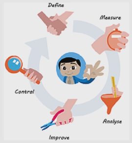

# Introduction

At this step we are going to discuss **Lean** project management.

# Overview of Lean project management

Lean has the following phases: **defining**, **measuring**, **analyzing**, **improving**, and **controlling**. This is similar to Agile: it's a loop that you go through during the process.

Lean is more about product development and manufacturing than project management. Lean started in the automotive industry and was pioneered by Toyota. Actually, it was called Lean only in the 1990s. Then Eric Rise and his mentor created Lean startup methodology. The whole idea of it is centered around iterative development similar to the one we discussed at the previous step.

The concept here is that you create a minimum buyable product to validate a business idea. You test it and see how it performs. And once you have something that's profitable, you improve on the product until you reach your ideal product. A fundamental idea of Lean is to get rid of any waste in the process,hence the name.

# Pros and cons of Lean

There's not really a whole lot of cons here. The one thing to keep in mind is that if you're working with really old-school business types, they may want you to prepare reports, presentations and things that the end customer will never see. This can take up a whole lot of time and Lean typically considers this wasteful. Depending on how old school your client is, he might want some of those, and might think that if you aren't giving them those then you aren't doing the job.

# How Lean applies to freelance work?

One of the things that you should avoid is reworking. So, you clarify the objectives and the goals and do it right from the start. And that relies heavily on effective communication process that we are going to discuss later. When you clarify the goals, you can avoid going back and redoing things later.

Another thing is iterative work cycles. You deliver something very basic or something that doesn't have the full functionality so that a client can you give feedback. However, if there's going to be one person who has to review every single part of the project and approve it, than that can cause a bottleneck. Therefore try to build your freelance processes so that there aren't any bottlenecks: the entire project should not depend on a single thing. For example, you should not get an approval from some person before you can do everything.

Lean can also help you reviewing the way that work elements and deliverables pass between you and the client or you and team members and try to improve those hand-offs. For example, how you can write more efficient emails, or how you can deliver things more efficiently. In this case that might mean using something like Dropbox or Google Drive. The idea is that you're improving the communication.

And, last but not the least, is the last planner principles. The idea here is that you plan in greater detail as you get closer to actually doing the work, and that you plan with those people who will do the work. Instead of planning out a whole project, you would plan out, for example, the first 25% of the work in detail. Then, you would have milestones, and an outline for the last 75% of the work, but you don't plan that in detail until you're 20 to 25% through the project. That way you don't waste a lot of time planning something, because if the project changes course, all those plans that are wasted.

A couple of the other things is to make reliable promises, to learn from breaking things down after the process, and to make sure that everybody is clear on the constraints of the project at hand.